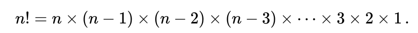
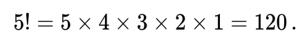

# Factorial

In mathematics, the factorial of a positive integer n, denoted by n!, is the product of all positive integers less than or equal to n:<sup id="pg1">[1](#fn1)</sup>.
<br>

<br>
For example,
<br>

<br>
The value of 0! is 1, according to the convention for the empty product.

In the factorial case study in the [initial](index.ts) source code, there are 3 methods that can be used to calculate the factorial value of a given n. These methods include:

## Loop method<sup id="pg2">[2](#fn2)</sup>

In this method, we use the most standard way, which is using a loop. An example can be seen in the source code below.

```js
function countUsingLoop(): number {
  let result = 1;

  for (let index = this.n; index > 0; index--) {
    result = result * index;
  }

  return result;
}
```

## Recursive method<sup id="pg2">[2](#fn2)</sup>

If during the interview we are prohibited from using loops, we can use the recursive method. Recursive is a function that calls itself repeatedly. An example can be seen in the source code below.

```js
function countUsingRecursive(n?: number): number {
  n ||= this.n;

  if (n < 2) {
    return 1;
  }

  return n * this.countUsingRecursive(n - 1);
}
```

## Tail recursive method<sup id="pg2">[2](#fn2)</sup>

If we look at the previous recursive method, we can see that the function has to wait until the last recursive function every time it calls itself.

```js
this.n = 5;

this.resultWithRecursive();
// 5 * (this.resultWithRecursive() = 4)
// 5 * 4 * (this.resultWithRecursive() = 3)
// 5 * 4 * 3 * (this.resultWithRecursive() = 2)
// 5 * 4 * 3 * 2 * (this.resultWithRecursive() = 1)
// 5 * 4 * 3 * 2 * 1 * (this.resultWithRecursive() = 0)
```

One of the problems that can arise when we use the recursive method is the occurrence of memory leak. The solution that can be used is to use tail recursive. Tail recursive is a recursive that does not seem to wait for the previous recursive. So the execution results will be as follows.

```js
this.initialN = 5;

this.resultWithTailRecursive();
// this.resultWithTailRecursive() // this.n = 5, result = 1
// this.resultWithTailRecursive() // this.n = 4, result = 5
// this.resultWithTailRecursive() // this.n = 3, result = 20
// this.resultWithTailRecursive() // this.n = 2, result = 60
// this.resultWithTailRecursive() // this.n = 1, result = 120
// this.resultWithTailRecursive() // this.n = 0, result = 120
```

An example of a tail recursive method can be seen in the source code below.

```js
function countUsingTailRecursive(): number {
  let result = 1;

  const count = () => {
    if (this.n < 1) {
      return result;
    }

    result *= this.n;
    this.n--;

    return count();
  };

  return count();
}
```

## Footnote

<strong id="fn1">1</strong> [Factorial, Wikipedia](https://en.wikipedia.org/wiki/Factorial). [↩](#pg1)
<br>
<strong id="fn2">2</strong> [Programmer Zaman Now - Coding Interview Factorial](https://www.youtube.com/watch?v=tcPmCOAl-X4). [↩](#pg2)
<br>
